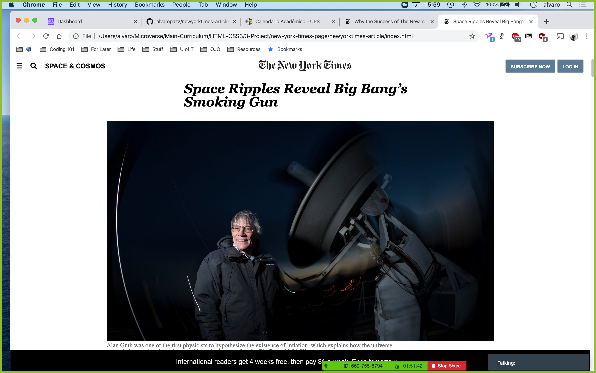

# Positioning and Floating Elements

> One paragraph statement about the project.

Additional description about the project and its features.

## Built With

- HTML, CSS,
- Visual Studio Code

## Live Demo

[Live Demo Link](https://alvaropazz.github.io/newyorktimes-article/)

## Getting Started

**In this project we created a clone of a New York Times article using CSS and HTML. The main themes applied in this project were Flexbox and Grids.**

## Authors

👤 **Alvaro Paz**

- Github: [@alvaropazz](https://github.com/alvaropazz)
- Twitter: [@alvaropazz](https://twitter.com/alvaropazz)
- Linkedin: [linkedin](https://www.linkedin.com/in/alvaropaz/)

👤 **Luis Octavio Ramírez Cruz**

- Github: [@LOctavio](https://github.com/LOctavio)
- Twitter: [@Octavio_ram431](https://twitter.com/Octavio_ram431)
- Linkedin: [linkedin](https://www.linkedin.com/in/luis-octavio-ramirez-cruz-714521178/)

## 🤝 Contributing

Contributions, issues and feature requests are welcome!

Feel free to check the [issues page](https://github.com/alvaropazz/newyorktimes-article/issues).

## Show your support

Give a ⭐️ if you like this project!

## 📝 License

This project is [MIT](lic.url) licensed.
